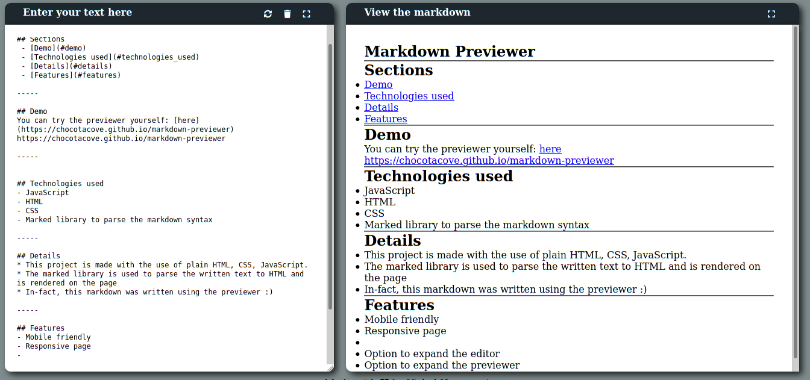
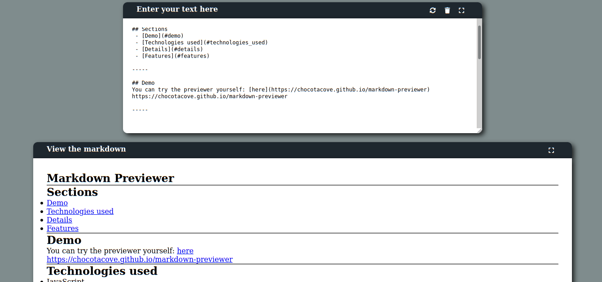

# Markdown Previewer

## Sections
 - [DEMO](#demo)
 - [FEATURES](#features)
 - [TECHNOLOGIES USED](#technologies-used)
 - [DETAILS](#details)

## Demo

## Features
- Mobile friendly
- Responsive page
- Markdown will update instantly as you type
- Expand the editor when working on the markdown
- Expand the previewer when viewing
- Rotate option
- Clear the text area instantly

## Technologies used
- JavaScript
- HTML
- CSS
- Marked library to parse the markdown syntax

## Details
* This project is made with the use of plain HTML, CSS, JavaScript.
* The marked library is used to parse the written text to HTML and is rendered on the page
* In-fact, this markdown was written using the previewer :)
